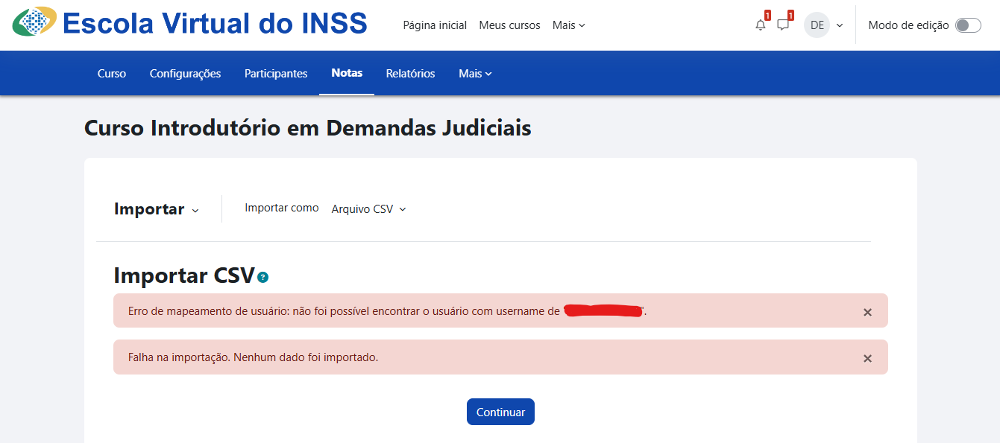
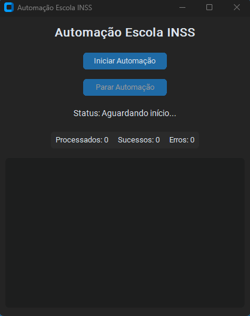
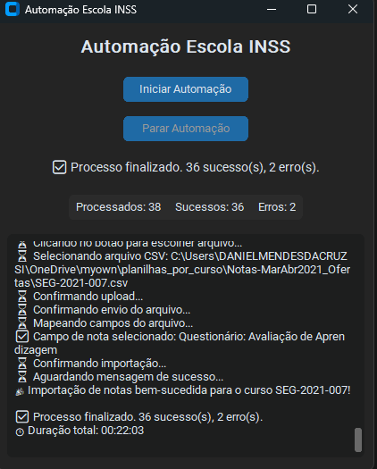
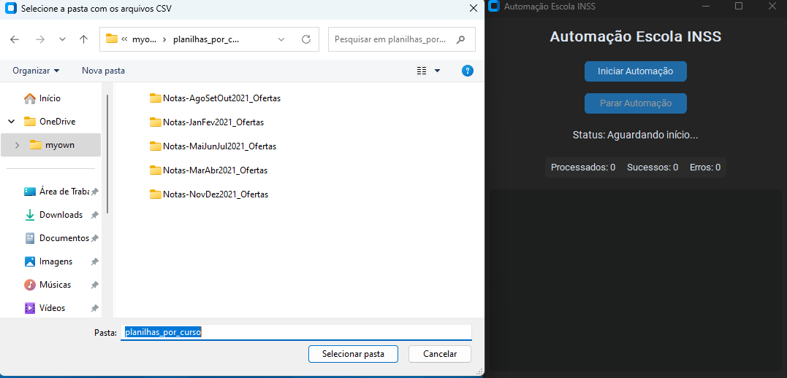

# Automação Escola INSS

Este projeto contém **scripts de automação em Python** desenvolvidos para auxiliar na gestão de cursos internos da Escola INSS (Moodle).  
⚠️ **Atenção:** Este repositório é **apenas para visualização e estudo**.  
O código depende de credenciais e ambientes internos, portanto **não é executável publicamente**.

---

## 📂 Estrutura do Projeto

- `data.py` → Lê os arquivos CSV brutos de inscrições e gera planilhas separadas por curso.  
- `auto.py` → Faz login na plataforma e envia os arquivos CSV preparados automaticamente.  
- `requirements.txt` → Dependências utilizadas.  
- `.gitignore` → Arquivos e pastas ignorados.  
- `README.md` → Documentação.  

---

## 🔹 Funcionamento

### 1. Preparação de planilhas (`data.py`)

1. Recebe uma pasta com arquivos de inscrições (ex: `Set-Out`).  
2. Separa os dados por curso e gera arquivos `.csv` organizados.  
3. Renomeia os arquivos conforme o código da oferta (ex: `SEG-INSS-001-19.csv`).  
4. Salva tudo em uma pasta chamada `planilhas_por_curso`.

---

### 2. Automação e envio (`auto.py`)

1. Abre o **explorador de arquivos** para selecionar a pasta com os CSVs.  
2. Faz login no Moodle (até 3 tentativas em caso de falha).  
3. Acessa cada curso e envia os arquivos automaticamente.  
4. **Tratamento de erros**:
   - Se algo falhar (login, botão não encontrado, CPF inválido), tira um **print automático** e salva em uma pasta de erros.  
   - Prints são nomeados conforme a oferta (ex: `SEG-INSS_error.png`).  
5. **Sucessos**:
   - Registra no log e continua para o próximo curso.

---

## 🖼 Exemplos visuais

### Erro detectado automaticamente

### Interface gráfica (aguardando comando)

### Interface gráfica (execução com erros e sucessos)

### Seleção da pasta com planilhas

---

## ⚙️ Tecnologias utilizadas

- **Python 3**
- **Pandas** → Manipulação de planilhas.  
- **Selenium** → Automação web.  
- **CustomTkinter** → Interface gráfica.  
- **Dotenv** → Variáveis de ambiente seguras.  

---

## ❌ Observações

- Projeto **não executável publicamente**.  
- Depende de credenciais do Moodle da Escola INSS e arquivos internos.  
- O objetivo é demonstrar:  
  - Automação web real.  
  - Estruturação e tratamento de dados.  
  - Tratamento de erros com prints automáticos.  
  - Interface gráfica de apoio.  

---

## 🤝 Conclusão

Mesmo como repositório de exibição, este projeto mostra:  

- Domínio de automações web reais.  
- Capacidade de organizar e processar dados.  
- Tratamento de erros robusto.  
- Experiência com interface gráfica em Python.  

> 📌 Objetivo: **apresentar habilidades em automação corporativa de forma clara e organizada**.
